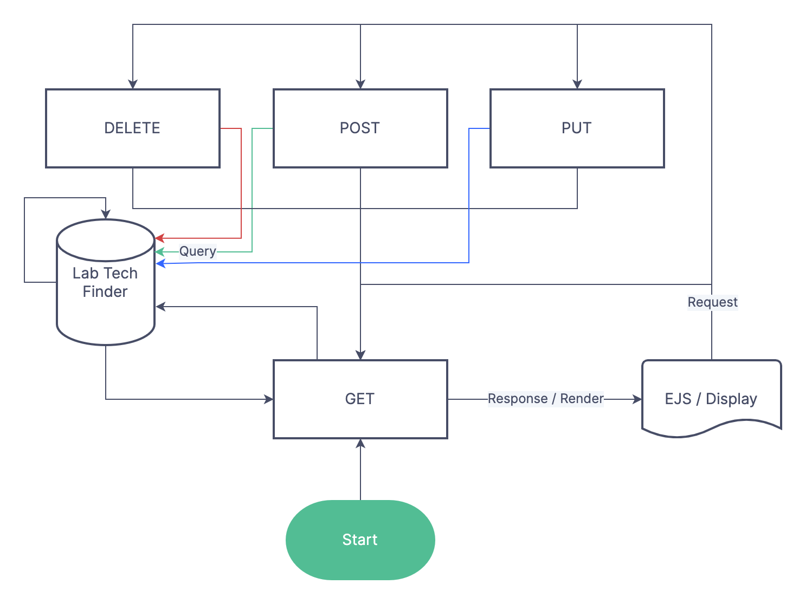

# Lab Tech Finder v1.0
### Social app to find a lab technician with a specific skill-set.
The app is designed with instituion-level scope in-mind.

Sometimes during a project, you unexpectedly required to implement or use a new or an obscure piece of technology. More often than not, you will need some form of guidance.

Optimising a protocol is [not cheap](https://www.ncbi.nlm.nih.gov/pmc/articles/PMC4582800/) and very time consuming! Be honest, you must have at least thrown away a few SDS-PAGE gels because either the concentration is too high or it did not set properly.

This is where Lab Tech Finder comes in! This app allows user to search fellow researchers based on their skills, as well as their lab's expertise! (lab field of study and publication feature will be added at later version). No more months of optimising protocol, just make sure you buy your mentor a coffe or a carton!

The app is designed with instituion-level scope in-mind. That means there is a subdivision of functionality for each user, depending on your account level. More details below.

---

Version 1.0 is made within 3 days as General Assembly project.

Hosted at Render.
[Use it here](https://lab-tech-finder.onrender.com/)

To get started, create your own lab by [Signing Up](https://lab-tech-finder.onrender.com/lab/new)!

# Features

## Daily News
Implemented [Axios](https://axios-http.com/) client to use the [newsdata](https://newsdata.io/) API. The news are the top-5 of the first page of the response from a curated list of news source.

It's not perfect, though, as the API is unable to capture pictures and articles reliably at times. For example, it can't capture both the picture and article from sciencealert.

The news are locked to Australia and *Science* parameters. Unfortunately the more *scientific* news sources tend to have poor image resolution. Probably because they are ripped from a journal.

The key is hardcoded with a maximum of 200 requests a day. So far I have not hit that number, even during development, so I have no idea what will happen when it does.

---

## Standard Convention CRUD features
Create, Read, Update and Delete entries from a database. For this project, postgreSQL is used.

In essence, the all pages will be displayed using GET method, while the endpoint of POST, DELETE and PUT are redirected to a GET route.

---

## One truth to rule them all
The database relies on laboratory id as a common denominator for all tables. This ensures appropriate labeling on all the CRUD proceses.

---

## Dynamic Search feature
All searches are case insensitive. It will detect search based on partial entries.

e.g. prot => proteomics

You can use multiple search term and it will detect also it automatically

e.g. prot gen => proteomics and genome

***All roads lead to Rome***

You have the options to search using different types of queries. For example to find a particular lab, you can search for it using either the laboratory name or Principal Investigator's name (PI).

## Database Structure

---

## Clean and SAFE

The dynamic search feature above is only possible due to the dynamic query string constructor.

Both the string constructor and the parameters are constructed based on how long segmented search terms are. They are then sanitised when passed into the database.

The app also uses [bcrypt](https://www.npmjs.com/package/bcrypt) to encrypt your password. I definitely do not know that your password is *1234*

---

## Access restrictions 

- Non-lab members can't edit other lab details at any level.
- Only PIs are allowed to delete their own lab
- Only PIs and Managers are allowed to update lab information.
- Only PIs, Managers and Self are allowed to "remove" a lab member up to their level.
- Only PIs and Managers are allowed to "add" a new lab member
- Only PIs and Managers are allowed to update a lab member's role up to one below their rank.
- Only a user can update their own skill list and password.
- Guests do not have any edit access. Only browse and sign up (and maybe message).

---

### Confirmation and Checks
- When deleting entries in database, you will be required to tick a box. Know the risk!
- When adding or creating password, you will not be able to continue if the password does not match the confirmation field.

---

## Routes
| Items | Method | Route | Done? |
| ----------- | ----------- | ----------- | ----------- |
| Home | GET | / | Y
| Browse lab form | GET | /lab | Y
| Browse lab | POST | /lab_search | Y
| Lab details | GET | /lab/:labid | Y
| Add lab form | GET | /lab/new | Y
| Add lab | POST | /lab/:labid | Y
| Delete lab | Delete | /lab/:labid | Y
| Edit lab details form | GET | /lab/:labid/edit | Y
| Edit lab details | PUT/PATCH | /lab/:labid | Y
| | | |
| Search lab member form | GET | /user | Y
| Search lab member | POST | /user_search | Y
| User details | GET | /user/:userid | Y
| Add lab member form | GET | /user/new | Y
| Add lab member | POST | /user/:userid | Y
| Remove lab member | DELETE | /user/:userid | Y
| Update lab member details form | GET | /user/:userid/edit | Y
| Update user details | PUT/PATCH | /user/:userid | Y
| | | |
| Log in form | GET | /session/login | Y
| Log in | POST | /session | Y
| Log out | DELETE | /session | Y
| | | |
| Useful links | GET | /links | Y
| About page | GET | /about | Y
| My lab | GET | /lab/:labid | Y
| | | |
| Get all messages | Get | /social/messages/:userid | Y
| Delete a message | Delete | /social/messages/:userid | Y
| Send a message form | Get | /social/send | Y
| Send a message | Post | /social/messages/:userid | Y

Note: more details in artefacts.

---

## Upcoming features
- [x] Login Sessions
- [x] Search by skills
- [x] Access level-based functionality
- [ ] More seeds!
- [x] Direct messaging
- [ ] Clean messages submission from apostrophe 
- [ ] 1 account per e-mail limit
- [ ] New message alert
- [ ] Image cloud hosting at cloudinary
- [ ] Proper reactive styling in small screen

---

## Not real people
**Disclaimer**: Photos are randomly generated from [This-Person-Does-Not-Exist](https://this-person-does-not-exist.com/en), an AI powered portrait generator. The names are also from various random name generators and items laying around my desk.

There are some sample pictures in the public directory. Use them whenever appropriate.

## Bugs
- Still dont understand how HTTP methods work exactly. What is a "resource" and why post is different from put / patch?
- What does ensure log in do?
- I FORGOT TO ADD SUPER USER!
- Server keep crashing on deployment. Possible routing or resource issue?
<!-- 4. Adding new lab member causes a bug where the picture not loaded properly. Exiting the page and reentering works, though. Currently redirecting to lab page to circumvent this problem. -->

## To Do List (For Later)
- [ ] UI Fixes
- [ ] Script to reset lost password
- [ ] Write more comments, especially the dynamic db query.
- [ ] Add useful links.
- [ ] Add the Abouts page with the content of this documentation.
- [ ] Remove commented out codes
- [ ] Advanced search feature
- [ ] Remove all "fired" people to 'unaffiliated' lab
- [ ] More tables! Encrypted newsdata API keys table?

